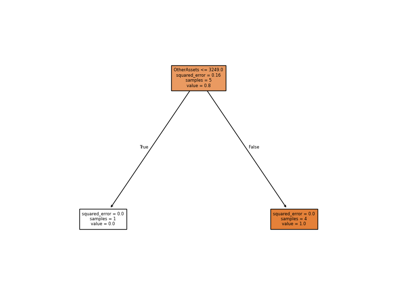

# 🌳 Swiggy Asset Prediction Using Decision Trees
Predictive Analytics • Machine Learning • Financial Statement Analysis

## Project Information

| Category | Details |
|----------|----------|
| Project Type | Business Analytics & Machine Learning |
| Industry | Food Delivery |
| Company | Swiggy |
| Tools Used | Python, Pandas, Scikit-Learn, Matplotlib |
| Analysis Type | Decision Tree Regression |
| Target Variable | Total Assets (TAD) |
| Status | Completed |

## Quick Navigation

- Executive Summary
- Business Context
- Objectives
- Dataset
- Methodology
- Results
- Business Relevance
- Conclusion

  
## Executive Summary

This project explores how machine learning can be applied to financial statement data.

Using Decision Tree Regression, the model attempts to predict Total Assets (TAD) based on other financial indicators from Swiggy's balance sheet.

## Business Context

Financial analysts frequently examine relationships among balance-sheet variables to understand how different financial factors contribute to a company's asset structure.

This project investigates whether financial indicators can be used to estimate Total Assets using a machine learning approach.

## Objectives

- Apply machine learning to financial statement data
- Predict Total Assets (TAD)
- Explore Decision Tree Regression
- Visualize model decision logic
- Evaluate predictive performance

## Dataset

Source:
Publicly available Swiggy balance-sheet data obtained from Screener.

Variables include:

- Equity Capital
- Reserves
- Borrowings
- Other Liabilities
- Investments
- Other Assets
- Total Assets

## Dataset Preview


## Tools & Technologies

| Tool | Purpose |
|--------|--------|
| Python | Analysis |
| Pandas | Data Processing |
| Scikit-Learn | Machine Learning |
| Matplotlib | Visualization |

## Methodology

### Step 1
Collected financial statement data.

### Step 2
Prepared and cleaned the dataset.

### Step 3
Separated predictor variables and target variable (TAD).

### Step 4
Performed train-test split.

### Step 5
Built a Decision Tree Regression model.

### Step 6
Evaluated predictions using R² Score and RMSE.

### Step 7
Visualized the trained decision tree.

## Core Model

```python
model = DecisionTreeRegressor(
    max_depth=4,
    random_state=42
)

model.fit(X_train, y_train)

y_pred = model.predict(X_test)
```

## Decision Tree Visualization



## Model Performance

| Metric | Value |
|----------|----------|
| R² Score | -1.0 |
| RMSE | 0.7071 |

### Interpretation

The model achieved an R² score of -1.0, indicating that it did not generalize well on the test dataset.

This outcome is primarily due to the extremely small dataset size, which limits the ability of machine learning algorithms to learn meaningful patterns and make reliable predictions.

Despite the performance limitations, the project successfully demonstrated the complete machine learning workflow, including data preparation, model training, evaluation, and visualization.

## Key Findings

- Other Assets emerged as the primary decision variable used by the Decision Tree model.
- The model generated a simple decision structure due to the limited number of available observations.
- Dataset size significantly influenced predictive performance and model generalization.
- The project demonstrated how machine learning models identify relationships among financial variables, even when prediction accuracy is constrained by data availability.

## Business Relevance

Machine learning techniques are increasingly used in finance to identify patterns, estimate key financial indicators, and support decision-making.

Although the dataset in this project was limited, the exercise demonstrates how predictive analytics can be applied to financial statement data and highlights the importance of data quality and dataset size in model performance.

## Learning Outcomes

Through this project, I strengthened my understanding of:

- Decision Tree Regression
- Predictive Analytics Fundamentals
- Train-Test Split Methodology
- Model Evaluation using R² and RMSE
- Machine Learning Workflows in Python
- Interpreting Model Limitations and Results

The project also highlighted the critical role of dataset size and quality in building reliable machine learning models.

## Conclusion

This project successfully applied Decision Tree Regression to financial statement data and explored the relationship between financial indicators and Total Assets.

The exercise strengthened understanding of predictive analytics, model training, evaluation techniques, and decision-tree interpretation.

## Future Scope

Potential extensions of this project include:

- Expanding the dataset with additional financial observations
- Random Forest Regression
- Gradient Boosting Models
- Financial Forecasting Techniques
- Multi-Company Financial Analysis
- Interactive Machine Learning Dashboards

## Analyst Insight

This project demonstrates an important analytics lesson:

Machine learning models are only as strong as the data provided.

Although the model did not achieve strong predictive performance, the exercise highlighted how dataset size directly affects model reliability and generalization.

Understanding model limitations is as important as building the model itself.

## About the Analyst

Mridul Krishna Parauha

BBA (Digital Marketing & AI)

